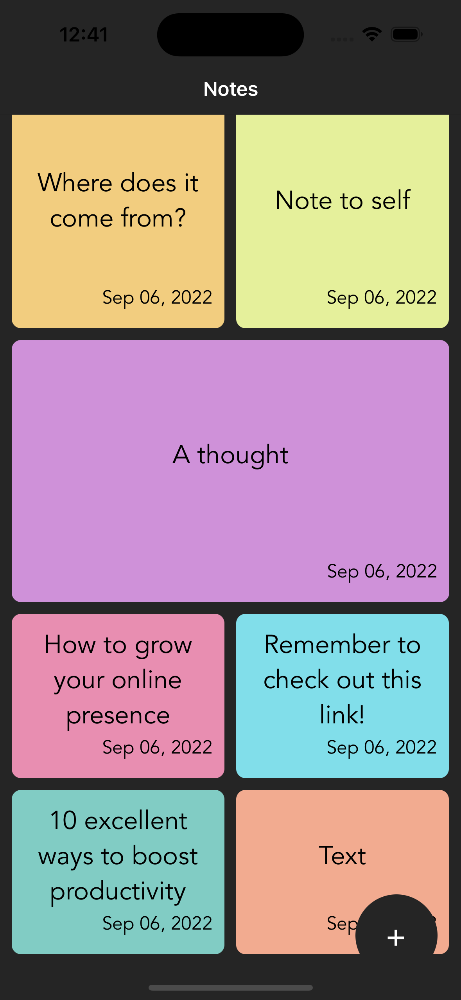
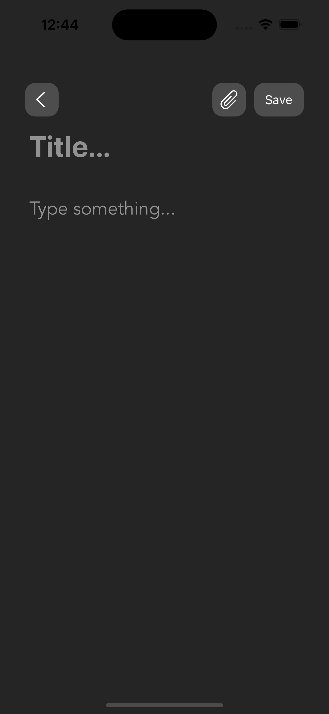
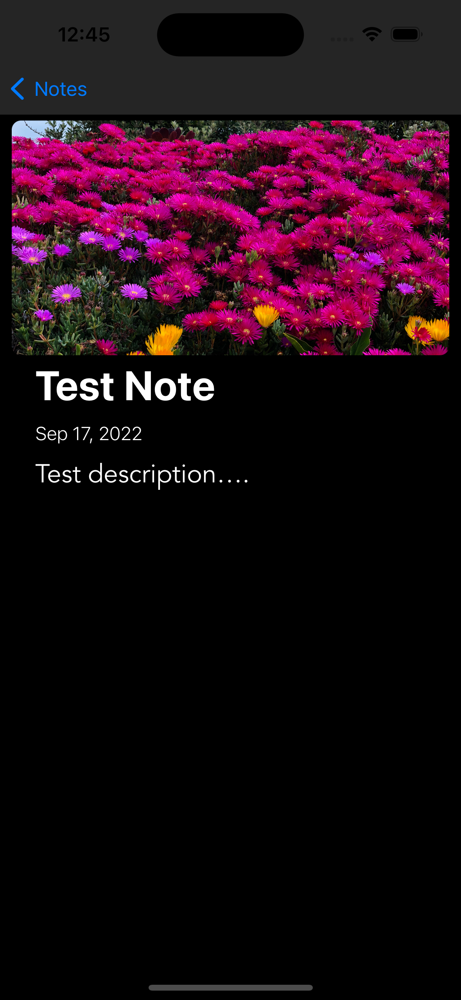
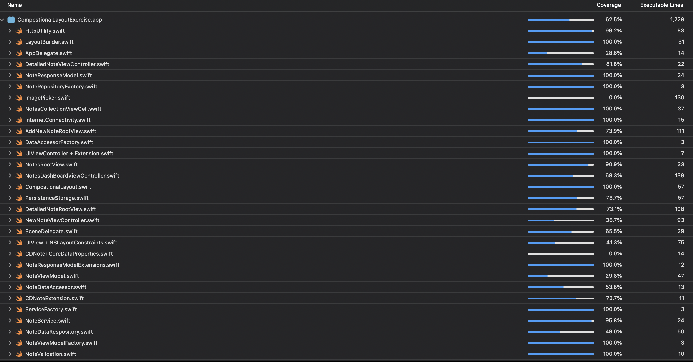

## Note App - Assigment
This task involves building a Notes app which allows you to create new notes to keep track of your tasks!. A note can have a title, body and an optional image. Notes are displayed in a grid style where the complete title of the note is visible along with its date of creation.

## Tools Used
* Xcode version 14
* iOS Simulator

## Technology Used
* UIKit
* MVVM
* Swift 5.5
* iOS 15
* Core Data

## Functionality 
* <u> Feature 1: Completed</u>
    * Fetch notes from API

* <u> Feature 2: Completed</u>
    * Save fetched notes to local storage

* <u> Feature 3: Completed</u>
    * Display selected note information

* <u> Feature 4: Completed</u>
    * Create and retrieve from local storage

##  Unit Tests
    * Core data stack unit test cases
    * ViewControler test
    * ViewModel test

## Screenshots

## Unit Test Code Coverage
